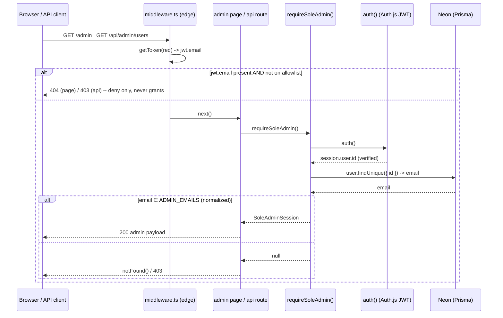

# CommodityPlay — Security Audit & Sole-Admin-by-Allowlist Design

**Author:** 高见远 (Gao), Architect
**Date:** 2026-09-26
**Scope:** (1) Prisma schema review, (2) Stripe / tier-gating leak audit, (3) Auth route security pass, (4) design for sole-admin-by-email-allowlist.
**Codebase snapshot:** `/commodityplay`, 334 files under `src/`, Next.js App Router + Prisma + Neon + Auth.js v5 (JWT) + Stripe + Resend.

> Verified facts used below: there is **no `src/middleware.ts`** in the repo, and **no rate-limiting dependency** in `package.json`. All 21 handlers across the 14 `/api/admin/*` route files do call a guard — the problem is that the guard (`requireAdmin()`) is role-based and therefore bypassable.

---

## 0. Executive summary

| Severity | Count | Headline |
|---|---|---|
| CRITICAL | 3 | Seeded `admin@demo.com` / `Demo1234!` is reachable in production via an un-gated `/demo` → **anyone can become admin**; any admin can mint another admin (`role` in `/api/admin/users` PATCH). |
| HIGH | 6 | `stripeStatus` never consulted for access; stale 30-day JWT keeps paid access after refund; client-side-only `TierGate` ships Elite payloads to Starter browsers; `ContentAsset.data Bytes` in Postgres; `KnowledgeTestResult` orphaned (GDPR); Pro sold as one-time but created as a subscription. |
| MEDIUM | 11 | No rate limiting anywhere; user enumeration + timing oracle; unverified email change; OAuth tokens at rest; missing indexes; `@map("isPublic")` consent confusion; webhook downgrades on unknown price ID. |
| LOW | 5 | Reset token in URL; `/api/setup-db` GET disclosure; `hirerToken` = cuid; `trustHost: true` with no redirect allowlist; expired `VerificationToken` rows never purged. |

The single most important architectural conclusion: **every authorization decision in this app that matters is derived from either `session.user.role` (a stale JWT claim) or `session.user.tier` (also stale)**. The fix is one central, DB-backed entitlement/authority module, not 30 scattered patches.

---

# AUDIT 1 — Prisma schema review

## 1.1 `KnowledgeTestResult` — orphan risk + compliance gap (HIGH)

`prisma/schema.prisma:201-208`

```prisma
model KnowledgeTestResult {
  id          String   @id @default(cuid())
  userId      String          // ← plain string, NO relation, NO onDelete, NO index
  score       Int
  gapAreas    Json
  completedAt DateTime @default(now())
}
```

Problems:
1. **No relation / no `onDelete`.** Deleting a `User` (every other user-owned model cascades) leaves their test results behind forever. A GDPR/erasure request cannot be honoured by `prisma.user.delete()` — this is the only model with that defect.
2. **No index on `userId`.** `src/app/api/knowledge-test/results/route.ts:21` does `findMany({ where: { userId } })` → sequential scan. Also unindexed: `orderBy: completedAt`.
3. `gapAreas Json` is written by `encodeKnowledgeTestGapAreas()` (`knowledge-test/results/route.ts:44-48`) which *packs* `testSetId` + `answers` into the `gapAreas` column. That is a hidden schema inside a `Json` blob — no way to query "results for set X".

**Minimal fix (migration):**
```prisma
model KnowledgeTestResult {
  userId String
  user   User   @relation(fields: [userId], references: [id], onDelete: Cascade)
  testSetId String @default("default")   // backfill from gapAreas
  @@index([userId, completedAt])
}
```
Migration order: (a) add nullable FK + index, (b) backfill `testSetId` from `gapAreas` with a script, (c) `DELETE FROM "KnowledgeTestResult" WHERE "userId" NOT IN (SELECT id FROM "User")` to clear existing orphans, (d) enforce the FK.

## 1.2 `ContentAsset.data Bytes` — binary blobs in Postgres (HIGH, cost + DoS)

`prisma/schema.prisma:257-273`; read path `src/app/api/content/assets/[id]/route.ts:59`

- Every download does `new Uint8Array(asset.data)` — the entire file is loaded into serverless memory, then for PDFs **re-encoded** by `stampPaidPdfWatermark()` (`pdf-lib`) before being returned. A 20 MB PDF costs ~3× that in memory and ~1 CPU-second per request.
- `size Int` is stored but **never enforced at upload** (`src/app/api/admin/content/assets/route.ts:19-33` POST) — an admin (or anyone who gets admin, see AUDIT 2) can upload a 500 MB blob and blow up Neon storage + egress billing.
- There is no streaming, no `Content-Length` guard, no CDN. Neon bills egress per GB; paid PDFs are re-downloaded by every member.
- `getContentAsset()` returns the `data` column even when callers only need metadata.

**Minimal fix (two steps):**
- *Now:* enforce `MAX_ASSET_BYTES = 15 * 1024 * 1024` in the upload route, reject `size > MAX`, and add `select: { data: false }` to metadata-only call sites.
- *Next:* move `data` to object storage (Vercel Blob / S3), keep `url String` on the row, stream through. Keep `data Bytes?` nullable during migration.

## 1.3 Missing indexes on hot paths (MEDIUM)

| Model | Missing | Why it matters |
|---|---|---|
| `Account` (`schema.prisma:14-31`) | `@@index([userId])` | Auth.js adapter queries accounts by `userId` on link/unlink. Only `@@unique([provider, providerAccountId])` exists. |
| `Session` (`schema.prisma:33-39`) | `@@index([userId])` | "Sign out everywhere" / session listing scans. |
| `MentorQuestion` (`schema.prisma:168-187`) | `@@index([userId])`, `@@index([isAnswered, createdAt])`, `@@index([deskChannelStatus])` | `mentor-connect/inbox/route.ts:22` `findMany`, `admin/users/route.ts:46-50` monthly `groupBy(userId)`, and the desk-channel queue filter all scan. |
| `QuizResult` (`schema.prisma:190-198`) | `@@index([userId])` | Per-user history. |
| `ChapterProgress` | — | OK: `@@unique([userId, chapterId])` has `userId` as leading column. |
| `ContentModuleRevision` | — | OK: `@@unique([moduleSlug, version])`. |

Also: `VerificationToken` (`schema.prisma:41-47`) has **no cleanup job** — every forgot-password request inserts a row and only deletes its own. Add a daily sweep (`deleteMany({ where: { expires: { lt: new Date() } } })`) or a cron.

## 1.4 `MentorQuestion.memberShareOptIn @map("isPublic")` (MEDIUM)

`schema.prisma:175`. The DB column is `isPublic`, the Prisma field is `memberShareOptIn`, and the public API accepts **both** names:

```ts
// src/app/api/mentor-connect/route.ts:18-19
memberShareOptIn: z.boolean().optional(),
isPublic: z.boolean().optional(),
// merged by parseMemberShareOptIn()
```

Publishing to Desk Channel requires **both** `memberShareOptIn` AND `mentorShareOptIn` plus `deskChannelStatus === "none"`. With a column literally called `isPublic` sitting next to a two-party consent model, the next migration or `$queryRaw` written against `isPublic` will publish a member's private question. **Fix:** rename the column to `memberShareOptIn` in a migration, delete `isPublic` from the public schema, and add a comment on the model stating both consents are required.

## 1.5 Sensitive data at rest (MEDIUM–HIGH)

`schema.prisma:20-21,25` — `Account.access_token`, `refresh_token`, `id_token` are stored as plaintext `@db.Text` (Google OAuth). A DB dump, a Neon backup, or a Prisma Studio session exposes live Google tokens for every social login. No admin route currently selects them (good) but nothing prevents it. **Fix:** encrypt at rest (pgcrypto or app-level AES-GCM with `ENCRYPTION_KEY`), or set `Account` tokens to `null` after the session is established since the app never uses them. Add a lint rule / code-review note: never `include: { accounts: true }` outside the adapter.

## 1.6 GDPR / delete-behaviour gaps (MEDIUM)

- `JobWaitlistEntry` (`schema.prisma:211-221`): `onDelete: SetNull` keeps `email`, `name`, `gdprOpt` after the user is deleted → PII survives erasure. Change to `Cascade` (the entry is meaningless without a user) or null the PII explicitly.
- No `deletedAt` / soft-delete and **no audit log** on `User`. `role` and `tier` mutations via `/api/admin/users` PATCH leave no trace of who did what. This matters directly for the sole-admin design (§4) — a promotion must be attributable. Add a `AdminAuditLog { id, actorEmail, action, targetUserId, before, after Json, createdAt }` model.

## 1.7 `Json` columns used where a relation is needed (LOW)

`ContentModule.payload Json` is legitimate (CMS blob, versioned via `ContentModuleRevision`). But:
- `ContentModuleRevision.moduleSlug` is a bare `String`, not an FK → deleting a module orphans its revisions.
- `JobChatThread.messages Json @default("[]")` (`schema.prisma:361`) grows without bound inside one row and cannot be queried (`exchangeCount` is denormalised beside it). Acceptable for the current volume; move to a `JobChatMessage` table when a thread exceeds ~50 messages.
- `QuizResult.scores Json` — fine (fixed small map).

## 1.8 Email normalisation is not enforced at the schema layer (HIGH — see §4)

`User.email @unique` is **case-sensitive** on Postgres. `src/app/api/auth/register/route.ts:32-41` creates the user with the raw, un-lowercased email, while `forgot-password/route.ts:25` lowercases before lookup. Consequences:
- `Frances@Gmail.com` and `frances@commodityplay.ai` are two distinct accounts.
- A user who registered with capital letters can **never reset their password**.
- Critically: **an `ADMIN_EMAILS` allowlist compared without normalisation is bypassable** (see §4.2).

**Fix:** add `normalizeEmail()` and apply it in register (web + mobile), login (`authorize`), forgot-password, reset-password, and `/api/account/profile`. Backfill existing mixed-case rows.

---

# AUDIT 2 — Stripe / tier-gating leak audit

## 2.1 CRITICAL — Seeded demo admin is reachable in production

- `src/lib/setup-database.ts:81` seeds `admin@demo.com` with `role: "ADMIN"`, `tier: "ELITE"`, password `Demo1234!` — **including into the Neon production database** (that is what `POST /api/setup-db` does).
- `src/app/demo/page.tsx:1` is `"use client"` with **no server-side gate at all**. It renders every account's email + a one-click `signIn("credentials", { email, password: DEMO_PASSWORD })` button (lines 27-44).
- `src/app/api/setup-db/route.ts:9-16` — the public GET helpfully replies *"Demo accounts are present. Use Demo1234! on /login."*

**Attacker path:** `GET https://<prod>/demo` → click "Admin User" → signed in as `admin@demo.com` → full admin. Same for `elite.vendor@demo.com` → free Elite.

**Minimal fix:** production sign-in deny-list (§4.5) + server gate on `/demo` (§4.6) + make the setup-db GET message generic.

## 2.2 CRITICAL — Any admin can mint another admin, and self-upgrade tier

`src/app/api/admin/users/route.ts:63-95`

```ts
role: z.enum(["USER", "ADMIN"]).optional(),   // :69
tier: z.enum(["STARTER","PRO","ELITE"]).optional(), // :68
...
if (userId === session.user.id && data.role === "USER") { /* self-demote guard :93 */ }
```

- There is a guard against **demoting yourself** but none against **promoting anyone**. One compromised admin session → a persistent second admin that survives a password reset on the first.
- `tier` is writable with no corresponding Stripe charge → free Elite for any admin (and for anyone they choose).
- `resumeCredits` / `onboardingDone` are also writable.

**Minimal fix:** delete `role` and `tier` from `updateSchema`; add `if (userId === session.user.id) reject` for privilege fields; add an `AdminAuditLog` write for every remaining mutation.

## 2.3 HIGH — `stripeStatus` is never consulted for access

Grepping `stripeStatus` across `src/` returns only **display** sites (`account/page.tsx`, `admin-client.tsx` filter chips, `account-billing-section.tsx`). No access decision reads it.

Concretely: `webhook/route.ts:92-100` handles `invoice.payment_failed` by setting `stripeStatus: "past_due"` and **leaving `tier: "ELITE"`**. The member keeps Elite until Stripe eventually cancels. `stripeCurrentPeriodEnd` is never checked either.

**Fix:** one entitlement resolver, used everywhere:
```ts
// src/lib/entitlements.ts
export function effectiveTier(u: { tier: string; stripeStatus: string|null; stripeCurrentPeriodEnd: Date|null }): Tier {
  if (u.tier === "STARTER") return "STARTER";
  if (u.stripeStatus && !["active","trialing"].includes(u.stripeStatus)) return "STARTER";
  if (u.stripeCurrentPeriodEnd && u.stripeCurrentPeriodEnd < new Date()) return "STARTER";
  return u.tier;
}
```

## 2.4 HIGH — Stale JWT keeps paid access after cancellation/refund

`src/lib/auth.ts:70-106`. The `jwt` callback copies `role`/`tier` into the token at sign-in and only re-reads the DB when `trigger === "update"`. No `session.maxAge` / `jwt.maxAge` is configured → **Auth.js default 30 days**.

Two call sites gate on the stale claim rather than the DB:
- `src/app/api/content/assets/[id]/route.ts:25` — `const tier = mobileUser?.tier ?? session?.user?.tier;` → a refunded Elite downloads paid PDFs for up to 30 days.
- `src/app/library/page.tsx:21` — `hasAccess(session.user.tier ?? "STARTER", "ELITE")`.

Everywhere else correctly re-reads the DB (`desk-channel/page.tsx:29`, `playbook/[chapter]/page.tsx:29`, `requireProSession`, `requireEliteSession`). The inconsistency is itself the bug.

**Fix:** forbid `session.user.tier`/`role` for authorization; route everything through `getEntitlements()` (§4.7). Set `session: { strategy: "jwt", maxAge: 7 * 24 * 3600 }`.

## 2.5 HIGH — Client-side-only tier gate ships Elite payloads to Starter browsers

`src/components/tier-gate.tsx` is a `"use client"` component. In `compact` mode (lines 49-63) it renders the gated children inside a `blur-sm pointer-events-none` div — **the content is in the DOM**. And in both modes the *data* has already been serialised into the RSC flight payload by the server:

- `src/app/desk-channel/page.tsx:26-33` passes **all** `desk.questions` to `DeskChannelClient` regardless of `user.tier`, then relies on `<TierGate requiredTier="ELITE">` inside the client.
- `src/app/library/page.tsx:20-29` passes `files`, `freeSection` and `eliteSection` regardless of `hasEliteAccess`.

**Attacker:** a Starter member opens View Source / the `.rsc` flight response / React DevTools and reads the entire Elite Desk Channel Q&A corpus and the Elite library listing. No request forgery needed.

**Minimal fix:** filter on the server before serialising props — `questions: hasElite ? desk.questions : []`, `eliteSection: hasElite ? eliteSection : null`. `TierGate` then only handles the upgrade CTA. Apply the same rule to every `TierGate` host: `desk-channel-client.tsx:87`, `resume-templates-client.tsx:487`, `mentor-connect-client.tsx:219`.

## 2.6 HIGH — Pro is sold as one-time but created as a monthly subscription

`src/app/api/stripe/checkout/route.ts:40-41`:
```ts
const priceId = plan === "elite" ? prices.ELITE_MONTHLY : prices.PRO_MONTHLY;
const mode = "subscription";     // ← both plans
```
Pricing (`docs`/landing): Pro = SGD 99 **one-time**, Elite = SGD 299 **/month**. Stripe will therefore rebill Pro members monthly — a billing dispute and a refund liability, not a security hole but a HIGH business defect. **Fix:** `const mode = plan === "elite" ? "subscription" : "payment";` and add a `payment_intent.succeeded` / `checkout.session.completed` branch that sets Pro without touching subscription fields, plus a `PRO_ONE_TIME_PRICE_ID`.

## 2.7 MEDIUM — Webhook trusts metadata for the tier; unknown price silently downgrades

`src/app/api/stripe/webhook/route.ts`:
- **Signature verification is correct** (`:14-23`: `req.text()` + `stripe-signature` header + `constructEvent`, 400 on failure). No finding here.
- `:35-36` derives tier from `session.metadata.plan` rather than from the purchased price. Metadata is set server-side in `checkout/route.ts:49` so it is not client-controlled today — but it is a trust boundary that costs nothing to close. Use `expand: ["line_items"]` and `getTierFromPriceId(...)`.
- `:58` `getTierFromPriceId()` (`src/lib/stripe.ts:62-67`) **returns `"STARTER"` for any unrecognised price** and `getStripePrices()` **throws** if `STRIPE_PRO_PRICE_ID`/`STRIPE_ELITE_PRICE_ID` are unset. So a rotated/misconfigured price ID → either a 500 (Stripe retries) or a silent Elite→Starter downgrade on the next `customer.subscription.updated`. **Fix:** on unknown price, keep the current tier, write an `AdminAuditLog`/log line, and return 200 so Stripe stops retrying.
- `:38-47` `checkout.session.completed` never persists `stripeCustomerId`, `stripePriceId` or `stripeCurrentPeriodEnd`, and never handles `mode === "payment"`.
- **No event idempotency table.** Out-of-order delivery (`subscription.updated` before `checkout.session.completed`) or a Stripe replay will re-apply stale state. **Fix:** add `StripeEvent { id String @id, type String, processedAt DateTime }`, insert in a transaction, skip if seen.

## 2.8 MEDIUM — `/api/content/assets/[id]`: public bypass is data-controlled, tier from JWT

`src/app/api/content/assets/[id]/route.ts:31-48`. Two bypasses:
- `isPublicStarterThumb` unlocks the asset for **completely unauthenticated** callers when `assetKey.startsWith("starter-pack/thumbs/")` and the MIME is an image. That predicate is admin-editable data: rename any asset key → world-readable. Pin this to an explicit `isPublic Boolean` column instead of a string prefix.
- `isPublicFooterGuide` with `?mode=view` likewise. Intentional (footer guides are public) but undocumented and unauthenticated.
- `:25` uses the stale JWT tier (see §2.4).

## 2.9 Confirmed clean (no finding)

- No `/api/user/*` route allows self-tier-upgrade: `/api/user/persona` (persona/track only), `/api/user/track`, `/api/user/progress`, `/api/account/profile` (email/company/profession only). Registration hardcodes `tier: "STARTER"` and takes no `role` — **no mass-assignment privilege escalation**.
- All 21 handlers across the 14 `/api/admin/*` route files call a guard. (The guard is wrong, not missing — §4.)
- `/api/mobile/*` content routes consistently go through `requireMobileContentAccess()` (`src/lib/mobile-content.ts`), which reads the user from the DB via the Bearer token. Good.

## 2.10 MEDIUM — Unverified email change enables account takeover

`src/app/api/account/profile/route.ts:38-57` lets a signed-in user change their email with no password re-entry and no verification email. Combined with `forgot-password` (which sends a reset link to whatever address is on the account), a stolen low-value session can be converted into permanent ownership. Also lets a user *evade* an email-based deny/allow list. **Fix:** require the current password, and require verification of the new address before it becomes the login identifier.

---

# AUDIT 3 — Auth route security pass

## 3.1 HIGH — No rate limiting anywhere

No `src/middleware.ts`, no rate-limit package in `package.json`. Unthrottled:

| Endpoint | Abuse |
|---|---|
| `POST /api/auth/[...nextauth]` (credentials) | credential stuffing / password spraying |
| `POST /api/mobile/auth/login` | same, mobile path |
| `POST /api/auth/register`, `/api/mobile/auth/register` | account creation spam, DB bloat, Resend quota |
| `POST /api/auth/forgot-password` | **email bombing** — every POST sends a Resend email. Unbounded cost + abuse complaints. |
| `POST /api/auth/reset-password` | token brute force (256-bit token makes this impractical, but still unthrottled) |

**Fix:** new `src/lib/rate-limit.ts` — in-process sliding window keyed on `ip + ":" + normalizedEmail` (5 attempts / 15 min, 20 / hour per IP), applied at the top of the five handlers above. Add `@upstash/ratelimit` + `KV_REST_API_URL` when running on more than one Vercel instance (in-process state is per-lambda, so treat it as a speed bump, not a wall). Also add a per-email daily cap on `forgot-password` (3/day).

## 3.2 MEDIUM — User enumeration + timing oracle

- `src/app/api/auth/register/route.ts:26-28` → `409 "An account with this email already exists."`
- `src/app/api/mobile/auth/register/route.ts:21` → `409 "Email already registered"`
- `authorize()` (`src/lib/auth.ts:45-52`) returns `null` for both unknown-user and wrong-password (correct), **but** `bcrypt.compare` is skipped entirely when the user does not exist → a measurable ~100 ms timing delta reveals whether an address is registered.
- `forgot-password` is correctly generic (`"If that email has an account…"`). Good.

**Fix:** always run one `bcrypt.compare(password, DUMMY_HASH)` before returning `null` on unknown user; make the 409 message generic ("Check your inbox to continue").

## 3.3 MEDIUM — Password policy is inconsistent

`register/route.ts:10` requires only `.min(8)`; `reset-password/route.ts:9-13` additionally requires uppercase + digit; mobile register requires `.min(8)` only. Hashing is **bcrypt cost 12** in all three places — correct. **Fix:** one exported `passwordSchema` in `src/lib/passwords.ts` used by all three, plus `.max(72)` (bcrypt truncation).

## 3.4 Password reset token — mostly good, one MEDIUM

`src/lib/password-reset.ts`:
- ✅ `randomBytes(32)` → 256-bit raw token; only the **sha256 hash** is stored (`:7-9`, `:13`).
- ✅ 1-hour TTL (`:5`), single-use (`delete` on consume `:35`, `deleteMany` on issue `:15`).
- ✅ Lookup by hashed value → no injectable comparison, no meaningful timing leak.
- ⚠️ **MEDIUM:** the raw token travels as a **query parameter** (`forgot-password/route.ts:31`): `?token=…`. It lands in browser history, `Referer` headers on any outbound link from `/reset-password`, Vercel access logs, and any CDN log. **Fix:** render a form that POSTs the token (or accept it once, exchange it for a short-lived httpOnly cookie, then redirect to a token-free URL). Add `Referrer-Policy: no-referrer` on `/reset-password` as a stopgap.
- ⚠️ **LOW:** reset URL origin falls back across three env vars (`:29-30`); with `trustHost: true` and none of them set in a preview deploy, the link can point at the wrong origin.

## 3.5 Registration mass assignment — CLEAN (LOW / informational)

`register/route.ts:7-13` and `mobile/auth/register/route.ts:8-13` accept only `name`, `email`, `password`, `plan`, `track`. `tier: "STARTER"` and `role` are hardcoded/defaulted. **No privilege escalation via signup.** Note `plan` is accepted and then silently discarded (`:11`, destructured out at `:23`) — dead input, remove it to avoid implying it does something.

## 3.6 JWT / session

| Issue | Severity | Detail / fix |
|---|---|---|
| **Stale `role`/`tier` after downgrade or refund** | HIGH | `src/lib/auth.ts:70-106` refreshes only on `trigger === "update"`. Confirmed: a refunded Elite retains `session.user.tier === "ELITE"` for up to the 30-day default JWT lifetime, and a demoted admin retains `role === "ADMIN"`. → §2.4 / §4.7. |
| **`trustHost: true`** (`:19`) | MEDIUM | Required for Vercel, but it makes Auth.js honour `X-Forwarded-Host`. With `NEXTAUTH_URL` unset, callback URLs (and therefore `callbackUrl` open-redirect) become host-influenced. → set `AUTH_URL`/`NEXTAUTH_URL` explicitly in prod and add a `redirect` callback that only allows same-origin relative paths. |
| **`AUTH_SECRET` never validated** | LOW | Auth.js v5 beta throws at runtime when unset → auth fails closed (acceptable). But the mobile routes use `process.env.AUTH_SECRET!` with `jsonwebtoken` directly: `sign(payload, undefined)` throws → HTTP 500 leaking a stack-free but noisy error. → validate once in a `src/lib/env.ts` and return a clean 503. |
| **No `session.maxAge` / `jwt.maxAge`** | MEDIUM | Defaults to 30 days. → set 7 days. |
| **No session revocation** | MEDIUM | Deleting a `User` or flipping their role does not invalidate outstanding JWTs (mobile: 30-day, non-revocable — no `tokenVersion` column). → add `User.tokenVersion Int @default(0)` and compare it in `getMobileUser`. |
| **Mobile JWT shares the Auth.js secret** | MEDIUM | `mobile/auth/login/route.ts:12-14` signs `{ userId }` with `AUTH_SECRET` and no `iss`/`aud`; `mobile-auth.ts:10` verifies with the same secret. Different payload shape, so Auth.js won't accept it today — but the shared secret and missing `aud` make future confusion likely, and `verify()` will accept an Auth.js session JWT if one is ever passed as a Bearer token (it would then fail on `payload.userId` being undefined → `findUnique` with `undefined` → Prisma error → 500, so not exploitable). → sign with `{ aud: "commodityplay-mobile", iss: "commodityplay" }` and verify both; shorten to 7 days. |

## 3.7 Routes that read identity from the client rather than the server

- **`src/app/demo/page.tsx`** — `"use client"`, performs `signIn()` with hardcoded credentials in the browser, no server gate. (See §2.1, CRITICAL.)
- `src/components/nav.tsx:93,163,217,310` and `landing-page-client.tsx:60` branch on `session?.user?.role === "ADMIN"` from `useSession()`. Cosmetic-only today (server still 403s) but it advertises admin UI. Fixed centrally by §4.4.
- **No route trusts a client-supplied user id** — every `/api/user/*`, `/api/account/*`, `/api/prep-library/*` derives the subject from `session.user.id`. Clean.

## 3.8 LOW

- `src/app/api/setup-db/route.ts:9-16` — public GET discloses seed state and hints the shared demo password. Make it generic.
- `src/app/api/job-chat/hirer/[token]/route.ts:44-53` — `hirerToken` defaults to `cuid()` (time-ordered, ~lower entropy than ideal) and is the sole bearer credential for an unauthenticated read/write of a candidate's chat. Switch to `randomBytes(16).toString("base64url")`.
- `src/app/api/auth/google-status/route.ts` — harmless capability disclosure.

---

# 4. DESIGN — Sole admin by email allowlist

## 4.1 Requirements (fixed, restated)

1. Only `frances@commodityplay.ai` may reach `/admin`, `/admin/database`, and all `/api/admin/*`. **Any** other account — including one with `role === "ADMIN"` — is refused. Must survive someone flipping another user's role to `ADMIN`.
2. Seeded demo accounts (`admin@demo.com` et al., password `Demo1234!`) work in dev/local only. In production they cannot sign in and cannot reach admin. `/demo` stays gated to Frances.
3. Allowlist is env-driven (`ADMIN_EMAILS`), defaults to `frances@commodityplay.ai` when `NODE_ENV !== "production"`, and **fails closed** if unset in production.

## 4.2 The central guard — `src/lib/admin-access.ts` (NEW)

```ts
import "server-only";
import { NextResponse } from "next/server";
import { auth } from "@/lib/auth";
import { prisma } from "@/lib/prisma";

/** Compile-time default. Only used when ADMIN_EMAILS is absent AND we are not in production. */
export const DEFAULT_DEV_ADMIN_EMAIL = "frances@commodityplay.ai";

export function normalizeEmail(value: string): string {
  return value.trim().toLowerCase();
}

/**
 * Fails closed: in production an unset/empty ADMIN_EMAILS yields NO admins.
 * In dev/test it falls back to DEFAULT_DEV_ADMIN_EMAIL so local work is unaffected.
 */
export function getAdminEmails(): string[] {
  const raw = process.env.ADMIN_EMAILS;
  const list = (raw ?? "")
    .split(",")
    .map(normalizeEmail)
    .filter(Boolean);
  if (list.length > 0) return Array.from(new Set(list));
  return isProduction() ? [] : [normalizeEmail(DEFAULT_DEV_ADMIN_EMAIL)];
}

export function isAdminEmail(email?: string | null): boolean {
  if (!email) return false;
  return getAdminEmails().includes(normalizeEmail(email));
}

export type SoleAdminSession = {
  user: { id: string; email: string; name?: string | null; image?: string | null; role: "ADMIN" };
};

/**
 * The single authority for "is this the sole admin".
 * - Reads identity from `auth()` (cookie-verified JWT) — never from request body/headers.
 * - Re-reads the email from the DB by id. NOT `session.user.email`: that is a stale
 *   JWT claim and is exactly what a role-flip attacker would ride on.
 * - Requires the DB email to be on the allowlist. `role` is deliberately NOT required:
 *   the allowlist is the invariant; requiring `role` adds a lockout risk with no gain.
 */
export async function requireSoleAdmin(): Promise<SoleAdminSession | null>;

/** API ergonomics: returns a ready 403 response, or null when access is granted. */
export async function assertSoleAdmin(): Promise<NextResponse | null>;

/** Page ergonomics: calls notFound() (404, not 403 — do not confirm /admin exists). */
export async function requireSoleAdminPage(): Promise<SoleAdminSession>;
```

Implementation notes for the Engineer:
- `isProduction()` = `process.env.VERCEL_ENV === "production" || process.env.NODE_ENV === "production"`.
- Log a `console.warn` once per cold start when production + empty allowlist, so a misconfiguration is visible.
- The DB read is one indexed `findUnique({ where: { id }, select: { email: true, name: true, image: true } })`. On Neon pooled connections this is ~2 ms; acceptable on every admin route.

**How it differs from `requireAdmin()`:**

| | `requireAdmin()` (old, `auth.ts:122`) | `requireSoleAdmin()` (new) |
|---|---|---|
| Source of truth | `session.user.role` — a JWT claim up to 30 days stale | `User.email` read from the DB, keyed on the verified session id |
| Bypass | Any account with `role: "ADMIN"` (grantable by any admin, or by `/demo` → `admin@demo.com`) | Only emails in `ADMIN_EMAILS` |
| Fails | Open (role is writable) | Closed (empty allowlist ⇒ no admins) |

## 4.3 Call-flow



## 4.4 Wiring points — file-by-file

| # | File | Change |
|---|---|---|
| 1 | **`src/lib/admin-access.ts`** (NEW) | The guard, per §4.2. |
| 2 | **`src/lib/auth.ts`** | (a) Re-implement `requireAdmin()` as `return requireSoleAdmin()` — **this one edit secures all 14 admin route files at once** (see §4.8). (b) In `authorize()` (`:45-47`) normalize the email and deny demo accounts in production (§4.5). (c) `jwt` callback (`:73`) and the `trigger === "update"` branch (`:96`): `token.role = isAdminEmail(dbEmail) ? "ADMIN" : (dbRole === "ADMIN" ? "USER" : dbRole)` — a single line that fixes every client-side `isAdmin(role)` check (`nav.tsx`, `landing-page-client.tsx`, `dashboard-client.tsx`). (d) `session: { strategy: "jwt", maxAge: 604800 }`. (e) Add a `redirect` callback allowing only same-origin relative paths. |
| 3 | **`src/lib/demo-guard.ts`** (NEW) | `isProduction()`, `isDemoAccountEmail(email)` (domain `@demo.com` + the `feedback-demo-users.ts` list), `demoSignInAllowed()`. |
| 4 | **`src/middleware.ts`** (NEW) | Edge deny-filter only, `matcher: ["/admin/:path*", "/api/admin/:path*", "/demo/:path*"]`. Uses `getToken()` from `next-auth/jwt` (no Prisma on edge). **Deny-only**: block when the token has an email that is not on the allowlist; otherwise `NextResponse.next()` and let the DB check decide. Document that this is defence in depth, not the boundary. |
| 5 | **`src/app/admin/layout.tsx`** (NEW) | Server layout calling `requireSoleAdminPage()`. **Must not be the only gate** — App Router layouts do not wrap route handlers (`/api/admin/*`) and a layout check does not stop a nested segment from fetching its own data, so keep #6 and #7. |
| 6 | **`src/app/admin/page.tsx`** | Replace `:14-15` with `const admin = await requireSoleAdminPage();`. |
| 7 | **`src/app/admin/database/page.tsx`** | Replace `:74-75` with `await requireSoleAdminPage();`. |
| 8 | **14 files under `src/app/api/admin/`** | Swap the import `requireAdmin` → `requireSoleAdmin` (or `assertSoleAdmin()` for terser handlers). Files: `content/route.ts`, `content/[slug]/route.ts`, `content/assets/route.ts`, `content/assets/[id]/route.ts`, `emails/route.ts`, `mentor/route.ts`, `mentor/[id]/route.ts`, `mentor/[id]/notify/route.ts`, `mentor/[id]/desk-channel/route.ts`, `mentors/route.ts`, `progress/route.ts`, `stats/route.ts`, `users/route.ts`, `waitlist/route.ts` (21 handlers total). |
| 9 | **`src/app/api/admin/users/route.ts`** | Additionally: delete `role` and `tier` from `updateSchema` (`:68-69`); reject `email` changes where the target's current email is on the admin allowlist (prevent lockout/impersonation); reject privilege-field changes to `userId === session.user.id`; write an `AdminAuditLog` row per mutation. |
| 10 | **`src/app/demo/page.tsx`** | Split: move the current `"use client"` body to `src/app/demo/demo-switcher.tsx`; new server `page.tsx` calls `requireSoleAdminPage()` then renders the switcher. Same for `src/app/demo/mentor-flow/`. |
| 11 | **`src/lib/demo-access.ts`** | `:18` `if (isAdmin(user.role)) return true;` → **delete**. `canAccessInternalDemo` becomes `isSoleAdminEmail(user.email)` (plus `isAdminEmail` for the support inbox), evaluated against a server session, never a client one. |
| 12 | **`src/app/api/mobile/auth/login/route.ts`** | After `bcrypt.compare`, `if (isProduction() && isDemoAccountEmail(user.email)) return 401`. |
| 13 | **`src/lib/email-normalize.ts`** or `admin-access.ts` export | `normalizeEmail()` applied in register (web + mobile), `authorize()`, forgot-password, reset-password, `/api/account/profile`. |
| 14 | **`.env.example`** | `ADMIN_EMAILS="frances@commodityplay.ai"` with a comment: *"Comma-separated. Production: if unset, nobody is admin (fails closed)."* |
| 15 | **`src/app/api/setup-db/route.ts`** | Generic GET message; in production, seed demo accounts with `passwordHash: null` (or gate demo seeding behind `ALLOW_DEMO_SEED === "true"`). |

## 4.5 Demo accounts in production (requirement 2)

Single choke point in `authorize()` (`src/lib/auth.ts:45-52`):

```ts
const email = normalizeEmail(parsed.data.email);
const user = await prisma.user.findUnique({ where: { email } });
if (!user?.passwordHash) return null;                       // existing
if (isProduction() && isDemoAccountEmail(user.email)) {     // NEW
  console.warn("[auth] demo sign-in blocked in production:", user.email);
  return null;
}
const valid = await bcrypt.compare(parsed.data.password, user.passwordHash);
if (!valid) return null;
```

This makes `admin@demo.com` unable to sign in at all in production, which also removes it from `/api/admin/*` — belt and braces with the allowlist.

Defence in depth, pick one: (a) also seed demo rows with `passwordHash: null` in production (`src/lib/setup-database.ts:81`); (b) or run a one-off `UPDATE "User" SET "passwordHash" = NULL WHERE email LIKE '%@demo.com'` against Neon. **Do (b) now** — it neutralises the existing production rows without a deploy.

## 4.6 `/demo` gating (requirement 2)

`/demo` is currently a pure client page. After the split in #10, the server page:

```tsx
export default async function DemoPage() {
  const admin = await requireSoleAdminPage();  // notFound() for everyone else
  return <DemoSwitcher accounts={DEMO_ACCOUNTS} password={DEMO_PASSWORD} />;
}
```

`notFound()` rather than `redirect()` so the route does not confirm its own existence to a stranger.

## 4.7 Stale-claim cleanup (pairs with §2.4 / §3.6)

New `src/lib/entitlements.ts`:
```ts
export async function getEntitlements(): Promise<{ userId, email, tier, effectiveTier, track, persona, isSoleAdmin } | null>
```
One DB read per request; used by `/api/content/assets/[id]`, `/library`, `/desk-channel`, `/playbook/[chapter]`, `requireProSession`, `requireEliteSession`, and `requireMobileContentAccess`. Rule for the Engineer: **`session.user.tier` and `session.user.role` may be used for cosmetic UI only — never to decide access.**

## 4.8 Compatibility / migration note for `requireAdmin()`

`requireAdmin()` is called in 14 files / 21 handlers. Two options:

- **Option A (recommended, minimal diff):** keep the name and re-implement the body in `src/lib/auth.ts` as a thin delegate to `requireSoleAdmin()`. All 21 call sites become allowlist-protected in a one-file change; the rename to `requireSoleAdmin()` is then a cosmetic follow-up (task T05). Risk: a future reader assumes it is role-based — mitigate with a doc comment.
- **Option B (explicit):** rename at all 21 sites in the same pass. Larger diff, zero ambiguity.

Either way `requireAdmin()`'s **return type changes** from `Session | null` to `SoleAdminSession | null`. The only field used downstream is `session.user.id` (`admin/content/[slug]/route.ts:84,99,239`), which is unchanged — so no call-site body edits are needed. `src/lib/utils.ts:isAdmin()` stays as-is for display purposes, but its `role` input will now be `ADMIN` only for allowlisted users thanks to the `jwt` callback change (#2c).

**Cleanup:** delete `admin@demo.com`'s ADMIN role from production (`UPDATE "User" SET role = 'USER' WHERE email = 'admin@demo.com'`) so the `adminCount` stat and nav badges stop implying a second admin exists.

## 4.9 Rollback

1. **Env-only, no deploy (partial):** set `ADMIN_EMAILS` to the addresses that need access. Covers "Frances is locked out". Does *not* restore role-based admin for arbitrary accounts.
2. **Full rollback:** revert the 4 files that carry the behaviour — `src/lib/auth.ts`, `src/lib/admin-access.ts` (delete), `src/app/admin/page.tsx`, `src/app/admin/database/page.tsx` — plus `src/middleware.ts` (delete). If Option A was taken, reverting `src/lib/auth.ts` alone restores the old role-based `requireAdmin()` for all 21 call sites because they import the same symbol.
3. **Verification after rollback or rollout:** `npm run lint` (tsc) + a manual matrix — Frances (allowlisted) → 200 on `/admin`; a second account with `role = 'ADMIN'` → 404 on `/admin`, 403 on `/api/admin/stats`; `admin@demo.com` → cannot sign in in production; `/demo` → 404 for non-Frances.

---

# 5. Implementation task list (for the Engineer)

Dependencies are strict: T01 blocks everything.

| ID | Task | Files | Deps | Pri |
|---|---|---|---|---|
| **T01** | **Admin allowlist core.** Create `src/lib/admin-access.ts` (`normalizeEmail`, `getAdminEmails`, `isAdminEmail`, `requireSoleAdmin`, `assertSoleAdmin`, `requireSoleAdminPage`). Re-implement `requireAdmin()` in `src/lib/auth.ts` as a delegate (Option A). Add the `jwt` callback role-derivation line, `session.maxAge = 7d`, and the `redirect` allowlist. Add `ADMIN_EMAILS` to `.env.example`. | `src/lib/admin-access.ts` (new), `src/lib/auth.ts`, `.env.example` | — | **P0** |
| **T02** | **Wire the guard everywhere.** Swap `requireAdmin` → `requireSoleAdmin` across the 14 `/api/admin/*` route files (21 handlers). Add `src/app/admin/layout.tsx`. Replace the role checks in `src/app/admin/page.tsx:14-15` and `src/app/admin/database/page.tsx:74-75`. | 14 files under `src/app/api/admin/`, `src/app/admin/layout.tsx` (new), `src/app/admin/page.tsx`, `src/app/admin/database/page.tsx` | T01 | **P0** |
| **T03** | **Lock down privilege writes.** Remove `role`/`tier` from `src/app/api/admin/users/route.ts` `updateSchema`; block email changes on allowlisted admins; block self-privilege changes; add the `AdminAuditLog` model + migration + write on every admin mutation. | `prisma/schema.prisma`, `src/app/api/admin/users/route.ts`, new migration | T01 | **P0** |
| **T04** | **Demo accounts + `/demo` gate.** Create `src/lib/demo-guard.ts`; add the production deny in `authorize()` and in `src/app/api/mobile/auth/login/route.ts`; split `src/app/demo/page.tsx` into a server gate + `demo-switcher.tsx`; delete the `isAdmin(user.role)` branch in `src/lib/demo-access.ts`; generic `setup-db` GET message. Also run the one-off Neon UPDATE nulling `@demo.com` password hashes. | `src/lib/demo-guard.ts` (new), `src/lib/auth.ts`, `src/lib/demo-access.ts`, `src/app/demo/page.tsx`, `src/app/demo/demo-switcher.tsx` (new), `src/app/api/mobile/auth/login/route.ts`, `src/app/api/setup-db/route.ts` | T01 | **P0** |
| **T05** | **Defence in depth + stale-claim cleanup.** Add `src/middleware.ts` (deny-only edge filter). Create `src/lib/entitlements.ts` (`effectiveTier`, `getEntitlements`) and repoint `/api/content/assets/[id]`, `/library`, `/desk-channel`, `requireProSession`, `requireEliteSession` off the JWT tier. Rename `requireAdmin` → `requireSoleAdmin` at all 21 sites (Option B cleanup). | `src/middleware.ts` (new), `src/lib/entitlements.ts` (new), `src/app/api/content/assets/[id]/route.ts`, `src/app/library/page.tsx`, `src/app/desk-channel/page.tsx`, `src/lib/prep-library-auth.ts`, `src/lib/account-intelligence-auth.ts`, 14 admin route files | T01–T04 | **P1** |
| **T06** | **Auth hardening pass.** `src/lib/rate-limit.ts` + wire into login/register/forgot-password/reset-password (web + mobile); shared `passwordSchema` (8–72 chars, upper+digit); constant-time dummy bcrypt on unknown user; generic 409 on register; reset token out of the query string; mobile JWT `iss`/`aud` + 7-day TTL + `User.tokenVersion`. | `src/lib/rate-limit.ts` (new), `src/lib/passwords.ts` (new), `src/lib/auth.ts`, 5 auth route files, `src/lib/mobile-auth.ts`, `prisma/schema.prisma` | T01 | **P1** |
| **T07** | **Schema + Stripe follow-ups.** `KnowledgeTestResult` relation/index/backfill; `ContentAsset` upload size cap; missing indexes (`Account.userId`, `Session.userId`, `MentorQuestion.userId/[isAnswered,createdAt]`, `QuizResult.userId`); `memberShareOptIn` column rename + drop `isPublic` from the API; Pro `mode: "payment"`; webhook price-based tier + `StripeEvent` idempotency + no-downgrade-on-unknown-price; server-side filtering of Elite payloads in `desk-channel/page.tsx` and `library/page.tsx`; email normalisation + verification on `/api/account/profile`. | `prisma/schema.prisma` + migration, `src/app/api/stripe/checkout/route.ts`, `src/app/api/stripe/webhook/route.ts`, `src/lib/stripe.ts`, `src/app/desk-channel/page.tsx`, `src/app/library/page.tsx`, `src/app/api/account/profile/route.ts`, `src/app/api/mentor-connect/route.ts` | T01 | **P2** |

**Definition of done for the P0 block (T01–T04):** Frances can reach `/admin` and all `/api/admin/*`; a second account with `role = 'ADMIN'` gets 404/403 everywhere; no `@demo.com` account can authenticate in production; `/demo` 404s for everyone but Frances; with `ADMIN_EMAILS` unset in production, every admin route refuses.
