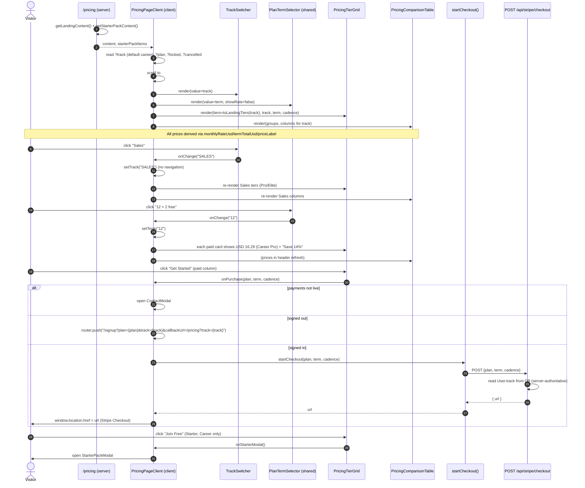
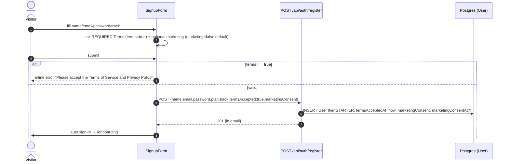
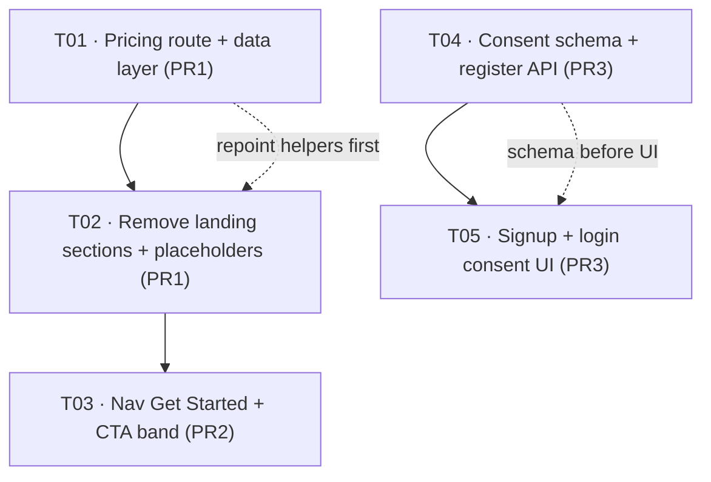

# CommodityPlay — Site Revamp: System Design & Task Breakdown

**Author:** Gao (Architect)
**Date:** 2026-10-08
**Source PRD:** `commodityplay-revamp-PRD-2026-10-08.md` (Xu)
**Repo:** `commodity-playbook-app/` (Next.js 16 App Router · React · Tailwind · Auth.js v5 · Prisma + Neon Postgres)
**Status:** Design for implementation. **Live production site with paying members — every change must be additive and anchor-safe.**

**Client decisions folded in (FIXED):**
1. Structure-only TradingView resemblance — light theme, existing blue/teal brand, **no dark restyle**.
2. Track presentation = **single comparison surface with a Career | Sales switcher** + the existing Monthly / 12+2 term toggle. **Career is the default**; Starter appears **only** in the Career view.
3. Nav: replace **"Join Free" → "Get Started" → `/pricing`**; keep "Sign in". Signed-out only; signed-in keeps the avatar + tier badge dropdown. Mirror in the mobile menu.
4. Login consent is **passive** (Terms/Privacy acknowledgment line + optional marketing opt-in; nothing blocks the button). The **required** T&C checkbox (with `*`) applies to **signup only**.
5. Marketing consent **is persisted** → schema change allowed.
6. Three staged PRs: **PR1** pricing page + section removal · **PR2** nav CTA + centered CTA · **PR3** auth consent.

---

## Part A — System Design

### 0. Corrections to the brief (verified against the code)

| Brief claim | Reality (verified) | Impact |
|---|---|---|
| "Stripe checkout success/cancel URLs" consume `pricing-routes.ts` | **False.** `src/app/api/stripe/checkout/route.ts:115-116` sets `success_url = ${origin}/account?upgraded=1` and `cancel_url = ${origin}/account?cancelled=1`. They never touch `/pricing` or the helpers. | **No Stripe URL change required.** Do not repoint the checkout redirects. |
| The `cancelled` query param that `pricing-redirect.tsx` forwards comes from Stripe | **False.** Nothing produces `/pricing?cancelled=…`. The only inbound `?locked=` producers are `playbook/[chapter]/page.tsx:57` (`?locked=playbook`) and `case-studies/[slug]/page.tsx:44` (`?locked=case-studies`). `locked`/`cancelled` are **inert pass-through params** today — no component reads them. | The new `/pricing` must **tolerate** `?locked=`/`?cancelled=` (render normally) but is not obliged to act on them. |
| Career pricing section = lines 292–378 | Verified: the `{/* Pricing */}` comment is **line 292**, `<section id="pricing">` **line 293**, the section closes at **line 377**. Testimonials open at **380**. | Remove **292–377**. |
| Sales pricing section = lines 330–463 | Verified: `{/* Sales pricing — Pro & Elite only */}` **line 330**, `<section id="pricing">` **line 331**, closes at **line 462**. Next section opens at **465**. | Remove **330–462**. |
| `pricing-tier-grid.tsx` is a reusable "existing pricing component" | Verified, **but** it hardcodes `track="CAREER"` (line 186) and the fallback href `CAREER_PLAN_HREF` (line 206). It is used **only** by the two landing pages — after PR1 removes both sections it has **no remaining caller** unless `/pricing` adopts it. | `/pricing` is its new (only) home; it must gain a `track` prop. |
| `CAREER_PRICING_PATH` is used by "signup callbacks" | Verified: the **only** consumer of `CAREER_PRICING_PATH` is `pricing-redirect.tsx:20`, which is being deleted. | `CAREER_PRICING_PATH`/`SALES_PRICING_PATH` are effectively dead once PR1 lands — keep the exports (cheap) but note they have no consumers. |

---

### 1. Implementation Approach

#### 1.1 Technical challenges

| # | Challenge | Resolution |
|---|---|---|
| C-1 | **Anchor integrity.** 13 files import `pricing-routes.ts`; 2 files hardcode `/?track=…#plan-*`. If the landing sections disappear while anchors still point at `/?track=…#pricing`, every in-app "Upgrade" button becomes a no-op scroll to nothing. | Repoint the **6 helper constants** to `/pricing…` (one-file change fixes 12 of 13 consumers), then fix the 2 hardcoded strings. Full table in §3. |
| C-2 | **Two tier shapes.** Career tiers are `LandingTier` (badge/highlight/tooltip); Sales tiers are `SalesPricingTier` (featured/description). The shared grid consumes `LandingTier[]`. | Add a tiny `toLandingTiers(track, content)` adapter so one grid renders both tracks. No new tier model. |
| C-3 | **Prices must stay derived.** PRD A5/C4: no hardcoded price strings. | Every number comes from `pricing-shared.ts` (`monthlyRateUsd`, `termTotalUsd`, `priceLabel`). We **add** `termSavingsPercent()` there; we do **not** add literal prices anywhere. |
| C-4 | **Term toggle drives 4 columns at once.** Today `PlanTermSelector` renders a per-tier rate line and is duplicated inside each card. On `/pricing` the toggle must be **shared above** the table and drive every column. | Render one `PlanTermSelector` above the grid with a new `showRate={false}` mode; each column renders its own derived price/sub-label/savings. |
| C-5 | **Persist consent without `prisma/migrations/`.** PRD F4. | Add columns via the idempotent, tolerant SQL in `db-schema-migrations.ts` (`CORE_MIGRATION_SQL`), keep `prisma/schema.prisma` in sync. |
| C-6 | **Track is server-authoritative at checkout.** `/api/stripe/checkout` reads `User.track` from the DB; the browser cannot set it. | The `/pricing` switcher is **presentational**. Signed-out purchase routes through `/signup?track=…` (sets `User.track`). **Signed-in: the switcher is pinned to the member's own track** (`userTrack` from the session; other segment disabled) — cross-track purchasing is impossible by design, so no mismatch can occur (R-1, confirmed). |

#### 1.2 Component decomposition

**NEW**
| Component | Path | Purpose |
|---|---|---|
| `PricingPageClient` | `src/components/pricing/pricing-page-client.tsx` | Client shell for `/pricing`: owns `track`/`term`/`cadence`/`loadingPlan`/`modalOpen`/`contactOpen`; reads `?track`/`?plan`/`?locked`/`?cancelled`; scrolls to `#plan-*`/`#pricing`; wires `startCheckout`, signup redirect, Starter modal. |
| `TrackSwitcher` | `src/components/pricing/track-switcher.tsx` | Segmented `Career | Sales` control (`role="radiogroup"`, light tone). |
| `PricingComparisonTable` | `src/components/pricing/pricing-comparison-table.tsx` | Long ✓/✗ comparison matrix, extracted from the two landing pages and parameterised by track (Career = 3 feature columns + Starter; Sales = 2). |
| `LandingPlaceholderSection` | `src/components/landing/landing-placeholder-section.tsx` | Clearly-marked TODO placeholder occupying the vacated pricing slot (PRD B1/B2). One shared component, one instance per landing page. |
| `PricingCtaBand` | `src/components/landing/pricing-cta-band.tsx` | Centered CTA band (headline + sub-line + button → `/pricing`). PR2. Shared by both landing pages (PRD E4). |

**REUSED (modified)**
| Component | Change |
|---|---|
| `PricingTierGrid` (`src/components/pricing/pricing-tier-grid.tsx`) | Add required `track: PlanTrack` prop; make the `onPurchase`-absent fallback href track-aware; add the **savings line** ("Save 14%") to each paid card. Becomes the `/pricing` top surface. |
| `PlanTermSelector` (`src/components/pricing/plan-term-selector.tsx`) | Add optional `showRate?: boolean` (default `true`) and make `track`/`tier` optional when `showRate === false` — enables the shared, above-the-table toggle. Existing callers (`account-billing-section.tsx`, sales panel before removal) are unaffected. |
| `pricing-routes.ts` | Repoint all 6 constants to `/pricing`. **The anchor migration.** |
| `pricing-shared.ts` | **Add** `termSavingsPercent()` + `PRICING_CTA_BAND` copy. Leave `PLAN_BASE_USD`, `PLAN_TERMS`, `monthlyRateUsd`, `termTotalUsd`, `priceLabel` **untouched**. |
| `landing-content.ts` | Update the two hardcoded career `href`s to `/pricing?track=career#plan-*`; align paid `cta` copy to "Get Started". |

**DELETED**
| File | Reason |
|---|---|
| `src/app/pricing/pricing-redirect.tsx` | Replaced by the real `/pricing` page. Its only job (client redirect) is gone; `CAREER_PRICING_PATH` loses its sole consumer. |

> **Design note — why a card grid + matrix, not a from-scratch "TradingView table".** PRD C2/4.1 describes a column-per-tier table with the CTA in the header and the ✓/✗ list below. The lowest-risk realisation on a live revenue page is to **reuse the existing card grid for the name/price/term/CTA header row** and **reuse the existing comparison markup for the ✓/✗ matrix**, stacked into one surface with a shared track + term control. This satisfies "single comparison surface with a switcher", keeps every price derived, and touches the least code. A full column-per-tier rewrite of the grid is explicitly rejected as higher-risk for PR1.

---

### 2. File List (create / modify / delete)

**PR1 — pricing page + section removal**
```
CREATE  src/components/pricing/track-switcher.tsx
CREATE  src/components/pricing/pricing-comparison-table.tsx
CREATE  src/components/pricing/pricing-page-client.tsx
CREATE  src/components/landing/landing-placeholder-section.tsx
MODIFY  src/app/pricing/page.tsx                     (real page; indexable; reads session → passes userTrack; renders PricingPageClient)
DELETE  src/app/pricing/pricing-redirect.tsx
MODIFY  src/lib/pricing-routes.ts                    (repoint 6 constants → /pricing)
MODIFY  src/data/pricing-shared.ts                   (add termSavingsPercent)
MODIFY  src/components/pricing/pricing-tier-grid.tsx (add `track` prop + savings line)
MODIFY  src/components/pricing/plan-term-selector.tsx (add showRate mode)
MODIFY  src/data/landing-content.ts                  (career tier hrefs → /pricing; CTA copy)
MODIFY  src/components/landing/landing-page-client.tsx   (remove §292–377; add placeholder)
MODIFY  src/components/landing/sales-landing-panel.tsx   (remove §330–462; add placeholder)
```

**PR2 — nav CTA + centered CTA band**
```
CREATE  src/components/landing/pricing-cta-band.tsx
MODIFY  src/components/nav.tsx                       (Join Free → Get Started → /pricing; desktop + mobile)
MODIFY  src/components/landing/landing-page-client.tsx   (mount PricingCtaBand)
MODIFY  src/components/landing/sales-landing-panel.tsx   (mount PricingCtaBand)
MODIFY  src/data/pricing-shared.ts                   (add PRICING_CTA_BAND copy)
```

**PR3 — auth consent**
```
CREATE  src/components/auth/consent-fields.tsx       (optional; shared required+optional blocks)
CREATE  src/app/api/account/marketing-consent/route.ts  (NEW — authed login opt-in, R-4)
MODIFY  prisma/schema.prisma                         (User: marketingConsent, marketingConsentAt, termsAcceptedAt)
MODIFY  src/lib/db-schema-migrations.ts              (idempotent ALTER TABLE … ADD COLUMN IF NOT EXISTS)
MODIFY  src/app/api/auth/register/route.ts           (accept + persist consent; termsAccepted REQUIRED)
MODIFY  src/app/(auth)/signup/page.tsx               (split gdpr → terms (required) + marketing (optional))
MODIFY  src/app/(auth)/login/login-form.tsx          (passive ack + optional opt-in → POST /api/account/marketing-consent)
```

> No `prisma/migrations/` directory is created. `prisma/schema.prisma` stays in sync with the runtime SQL.

---

### 3. Anchor Migration Table (the highest-risk part of PR1 — exhaustive)

#### 3.1 `src/lib/pricing-routes.ts` — the 6 constants

| Constant | Current value | New value |
|---|---|---|
| `CAREER_PRICING_HREF` | `/?track=career#pricing` | `/pricing?track=career#pricing` |
| `CAREER_PLAN_HREF(plan)` | `/?track=career#plan-${plan}` | `/pricing?track=career#plan-${plan}` |
| `SALES_PRICING_HREF` | `/?track=sales#pricing` | `/pricing?track=sales#pricing` |
| `SALES_PLAN_HREF(plan)` | `/?track=sales#plan-${plan}` | `/pricing?track=sales#plan-${plan}` |
| `CAREER_PRICING_PATH` | `/?track=career` | `/pricing?track=career` |
| `SALES_PRICING_PATH` | `/?track=sales` | `/pricing?track=sales` |

The `#pricing` / `#plan-*` fragments are **preserved** so old deep-link semantics still resolve (PRD A6). The new `/pricing` page must therefore expose `id="pricing"` (controls/table wrapper) and `id="plan-pro"` / `id="plan-elite"` / `id="plan-starter"` (per column), each with `scroll-mt-24`.

#### 3.2 Every consumer of `pricing-routes.ts`

| # | File:line | Symbol | Rendered where | Old target | New target (after repoint) | Risk |
|---|---|---|---|---|---|---|
| 1 | `src/components/pricing/pricing-tier-grid.tsx:10,206` | `CAREER_PLAN_HREF` | fallback `<Link>` when `onPurchase` absent | `/?track=career#plan-*` | `/pricing?track=career#plan-*` | **P0** — must be track-aware; `/pricing` always passes `onPurchase` so this branch is dead, but leaving `CAREER_*` hardcoded would mis-route Sales if reused. Fix: derive from the new `track` prop. |
| 2 | `src/app/dashboard/dashboard-client.tsx:19,213` | `CAREER_PLAN_HREF` / `SALES_PLAN_HREF` | dashboard "Upgrade" `planHref(tier)` | `/?track=…#plan-*` | `/pricing?track=…#plan-*` | **P0** — currently points at a section being deleted. |
| 3 | `src/app/playbook/playbook-hub-client.tsx:16,211` | `CAREER_PLAN_HREF("pro")` | locked-chapter upgrade link | `/?track=career#plan-pro` | `/pricing?track=career#plan-pro` | P0 |
| 4 | `src/components/dashboard/prep-library-section.tsx:12,88,114,665` | `CAREER_PLAN_HREF` / `SALES_PLAN_HREF` | upgrade hrefs | `/?track=…#plan-*` | `/pricing?track=…#plan-*` | P0 |
| 5 | `src/app/library/library-client.tsx:13,130` | `CAREER_PLAN_HREF("elite")` | Elite gate link | `/?track=career#plan-elite` | `/pricing?track=career#plan-elite` | P0 |
| 6 | `src/components/dashboard/sales-market-nudges-section.tsx:10,201,309` | `SALES_PLAN_HREF` | upgrade hrefs | `/?track=sales#plan-*` | `/pricing?track=sales#plan-*` | P0 |
| 7 | `src/components/dashboard/account-intelligence-section.tsx:12,680` | `SALES_PLAN_HREF("elite")` | Elite gate link | `/?track=sales#plan-elite` | `/pricing?track=sales#plan-elite` | P0 |
| 8 | `src/data/footer-content.ts:1,58` | `CAREER_PRICING_HREF` | footer "Be a Member" | `/?track=career#pricing` | `/pricing?track=career#pricing` | P0 |
| 9 | `src/app/starter-pack/starter-pack-client.tsx:17,69,76,78` | `CAREER_PLAN_HREF("pro")` | signup callbackUrl + checkout fallback | `/?track=career#plan-pro` | `/pricing?track=career#plan-pro` | P0 — see R-3 (hash-in-callbackUrl). |
| 10 | `src/components/tier-gate.tsx:10,14,18` | `CAREER_PLAN_HREF` | pro/elite gate links | `/?track=career#plan-*` | `/pricing?track=career#plan-*` | P0 |
| 11 | `src/components/landing/landing-page-client.tsx:43,109,116,118` | `CAREER_PRICING_HREF` | signup callbackUrl + checkout fallback | `/?track=career#pricing` | `/pricing?track=career#pricing` | P0 — line 109 is the only consumer that would have been broken by removing the section; see R-3. |
| 12 | `src/components/landing/sales-landing-panel.tsx:27,146,148` | `SALES_PRICING_HREF` | checkout fallback | `/?track=sales#pricing` | `/pricing?track=sales#pricing` | P1 |
| 13 | `src/app/pricing/pricing-redirect.tsx:5,20` | `CAREER_PRICING_PATH` | the redirect itself | — | **file deleted** | n/a |

#### 3.3 Hardcoded (non-helper) anchor / query references

| File:line | Current | New | Action |
|---|---|---|---|
| `src/data/landing-content.ts:304` | `href: "/?track=career#plan-pro"` | `"/pricing?track=career#plan-pro"` | **Update** (career Pro tier `href`; currently unreferenced by the grid — `tier.href` is only used for Starter — but keep correct). |
| `src/data/landing-content.ts:322` | `href: "/?track=career#plan-elite"` | `"/pricing?track=career#plan-elite"` | **Update** (career Elite tier `href`). |
| `src/data/landing-content.ts:341` | `href: "/signup?plan=pro"` | `"/pricing?track=sales#plan-pro"` | **Update** (sales Pro tier; old sales cards are removed in PR1). |
| `src/data/landing-content.ts:357` | `href: "/signup?plan=elite"` | `"/pricing?track=sales#plan-elite"` | **Update** (sales Elite tier). |
| `src/components/nav.tsx:18-19` | `"/?track=career"`, `"/?track=sales"` | **unchanged** | Track browse links — keep. |
| `src/data/footer-content.ts:47-48` | `"/?track=career"`, `"/?track=sales"` | **unchanged** | Track browse links — keep. |
| `src/app/dashboard/dashboard-client.tsx:515,520` | `"/?track=career"`, `"/?track=sales"` | **unchanged** | Track browse links — keep. |
| `src/components/landing/sales-landing-panel.tsx:138` | `callbackUrl=/?track=sales` | `callbackUrl=/pricing?track=sales` | **P2 optional** — purchase-intent post-signup destination; `/pricing` reads better than the landing top. |
| `src/components/landing/sales-landing-panel.tsx:493` | `callbackUrl=/?track=sales` (Starter "Join Free") | **unchanged** | Free-signup path; landing top is fine. |

#### 3.4 `/pricing?locked=` producers (now resolve to the real page)

| File:line | URL | New behaviour |
|---|---|---|
| `src/app/playbook/[chapter]/page.tsx:57` | `redirect("/pricing?locked=playbook")` | Unchanged URL; the **real** page renders (no redirect loop). `?locked` is currently inert — page renders normally. |
| `src/app/case-studies/[slug]/page.tsx:44` | `redirect("/pricing?locked=case-studies")` | Same. |

> Optional enhancement (P2): have `PricingPageClient` read `?locked` and show a "This content needs a paid plan" notice. Not required by the PRD.

#### 3.5 Stripe flow — **no change**

| File:line | Value | Action |
|---|---|---|
| `src/app/api/stripe/checkout/route.ts:115` | `success_url = ${origin}/account?upgraded=1` | **Do not change.** |
| `src/app/api/stripe/checkout/route.ts:116` | `cancel_url = ${origin}/account?cancelled=1` | **Do not change.** |

---

### 4. Data Structures & Interfaces

#### 4.1 `pricing-shared.ts` — extend, don't rewrite

**Add (leave everything else untouched):**
```ts
/**
 * Discount of a term versus the monthly rate, as a whole percent, rounded DOWN.
 * monthly -> 0 ; "12" -> floor((1 - 12/14) * 100) = floor(14.2857) = 14.
 * Single source for the "Save 14%" line (PRD C5).
 */
export function termSavingsPercent(term: PlanTerm): number {
  const { paidMonths, accessMonths } = PLAN_TERMS[term];
  if (paidMonths >= accessMonths) return 0;
  return Math.floor((1 - paidMonths / accessMonths) * 100);
}

/** Centered CTA band copy (PRD E3) — headline + supporting line + button. */
export const PRICING_CTA_BAND = {
  eyebrow: "Plans & pricing",
  title: "Find the plan that fits your desk.",
  description:
    "Compare Career and Sales tracks side by side — monthly, or 12 months + 2 free.",
  button: "Get Started",
} as const;
```

**Do NOT touch:** `PLAN_BASE_USD`, `PLAN_TERMS`, `PLAN_TERM_ORDER`, `monthlyRateUsd`, `termTotalUsd`, `termDiscountCents`, `priceLabel`, `priceLabelPerMonth`, `formatUsd`, `PRICING_CONTENT_FOOTNOTE`, `PRICING_CTA`, the `*_SUBSCRIPTION` objects. `PRICING_HERO` may be reused verbatim for the `/pricing` hero.

#### 4.2 `pricing-tier-grid.tsx` — prop change

```ts
interface Props {
  tiers: LandingTier[];
  variant: "landing" | "page";
  /** NEW — the track this grid renders. Drives PlanTermSelector and the
   *  no-onPurchase fallback href. Default "CAREER" keeps any stray caller working. */
  track?: PlanTrack;                       // default: "CAREER"
  onStarterModal?: () => void;
  onPurchase?: (plan: "pro" | "elite", term: PlanTerm, cadence: BillingCadence) => void;
  loadingPlan?: string | null;
}
```
Internally:
- `PlanTermSelector track={track}` (was hardcoded `"CAREER"`, line 186).
- Fallback `<Link href={track === "SALES" ? SALES_PLAN_HREF(...) : CAREER_PLAN_HREF(...)}>` (was `CAREER_PLAN_HREF` only, line 206).
- New **savings line** on paid cards: `{term === "12" && <span>Save {termSavingsPercent("12")}%</span>}` (hidden on monthly).

#### 4.3 `plan-term-selector.tsx` — additive, backward-compatible

```ts
interface PlanTermSelectorProps {
  track?: PlanTrack;                 // now OPTIONAL (required only when showRate !== false)
  tier?: PlanTier;                   // now OPTIONAL (required only when showRate !== false)
  value: PlanTerm;
  onChange: (term: PlanTerm) => void;
  cadence?: BillingCadence;
  onCadenceChange?: (c: BillingCadence) => void;
  tone?: "light" | "dark";
  /** NEW — false hides the per-tier rate line, for the SHARED toggle above the table. */
  showRate?: boolean;                // default: true
}
```
When `showRate === false`, render only the `Monthly | 12 + 2 free` segmented control (and the billed-monthly/annually sub-toggle); skip the `monthlyRateUsd`/`termTotalUsd` label. All existing call sites (`account-billing-section.tsx`, `sales-landing-panel.tsx` pre-removal) keep passing `track`/`tier` and are unaffected.

#### 4.4 New components — TypeScript signatures

```ts
// src/components/pricing/track-switcher.tsx
export interface TrackSwitcherProps {
  value: PlanTrack;                    // "CAREER" | "SALES"
  onChange: (track: PlanTrack) => void;
  /** R-1: when set (signed-in), the switcher is pinned to this track and the
   *  other segment is disabled with `lockedNote`. Null/undefined = fully live. */
  pinnedTrack?: PlanTrack | null;
  lockedNote?: string;                 // e.g. "Your account is on the Career track"
  className?: string;
}
export function TrackSwitcher(props: TrackSwitcherProps): JSX.Element;

// src/components/pricing/pricing-comparison-table.tsx
export interface PricingComparisonTableProps {
  /** Career groups carry a `starter` boolean; Sales groups only pro/elite. */
  groups: FeatureComparisonGroup[];
  /** Which tier columns to render, left→right. */
  columns: Array<{ key: "starter" | "pro" | "elite"; label: string }>;
  tone?: "light" | "dark";             // /pricing uses "light"
}
export function PricingComparisonTable(props: PricingComparisonTableProps): JSX.Element;

// src/components/landing/landing-placeholder-section.tsx
export interface LandingPlaceholderSectionProps {
  id?: string;                         // anchor id, e.g. "coming-soon"
  eyebrow?: string;                    // default "Coming soon"
  title?: string;                      // default "New content on the way"
  note?: string;                       // default explains it replaces the old pricing block
}
export function LandingPlaceholderSection(props: LandingPlaceholderSectionProps): JSX.Element;

// src/components/landing/pricing-cta-band.tsx
export interface PricingCtaBandProps {
  eyebrow?: string;                    // default PRICING_CTA_BAND.eyebrow
  title?: string;                      // default PRICING_CTA_BAND.title
  description?: string;                // default PRICING_CTA_BAND.description
  button?: string;                     // default PRICING_CTA_BAND.button
  href?: string;                       // default "/pricing"
}
export function PricingCtaBand(props: PricingCtaBandProps): JSX.Element;

// src/components/pricing/pricing-page-client.tsx
export interface PricingPageClientProps {
  /** CMS-merged landing content (career + sales tiers + comparison tables). */
  content: LandingContent;
  /** R-1: the signed-in member's track (from the server session). When present the
   *  TrackSwitcher is pinned to it; null/undefined (signed out) = fully live switcher. */
  userTrack?: PlanTrack | null;
  starterPackItems?: string[];
  starterPackHeadline?: string;
}
export function PricingPageClient(props: PricingPageClientProps): JSX.Element;
```

#### 4.5 `PricingPageClient` internal state

```ts
type Track = "career" | "sales";
const [track, setTrack] = useState<Track>("career");       // Career default (decision #2)
const [term, setTerm] = useState<PlanTerm>("monthly");
const [cadence, setCadence] = useState<BillingCadence>("monthly");
const [loadingPlan, setLoadingPlan] = useState<string | null>(null);
const [modalOpen, setModalOpen] = useState(false);         // Starter pack
const [contactOpen, setContactOpen] = useState(false);     // payments-off fallback
// read ?track → setTrack; read ?plan=pro|elite → scroll to #plan-{plan}; else hash → scroll
// R-1: if props.userTrack is set (signed in), pin `track` to it and pass
//      pinnedTrack={userTrack} to TrackSwitcher (other segment disabled + lockedNote).
//      Signed out → userTrack is null → fully live switcher; ?track drives setTrack.
```

Track → tiers adapter (keeps prices derived; reuses CMS content):
```ts
function toLandingTiers(track: Track, content: LandingContent): LandingTier[] {
  if (track === "career") return content.pricing.tiers;          // Starter | Pro | Elite
  return content.sales.pricing.map((t) => ({                     // SalesPricingTier → LandingTier
    name: t.name,
    price: t.price, billing: t.billing,
    badge: t.name === "Elite" ? "elite" : "pro",
    highlight: Boolean(t.featured),
    tooltip: t.description, description: t.description,
    features: t.features, cta: "Get Started",
    href: `/pricing?track=sales#plan-${t.name.toLowerCase()}`,
  }));
}
```

---

### 5. Call Flow

#### 5.1 `/pricing` load, track/term switching, and CTA → `startCheckout()` (no page reload)



#### 5.2 Signup consent (PR3)



---

### 6. Schema + API design (PR3)

#### 6.1 `prisma/schema.prisma` — `User` model additions

```prisma
model User {
  // …existing fields…
  /// Member opted in to the Email Digest / onboarding & marketing emails.
  marketingConsent   Boolean   @default(false)
  /// When marketing consent was last set (audit / compliance).
  marketingConsentAt DateTime?
  /// When the member accepted the Terms of Service + Privacy Policy.
  termsAcceptedAt    DateTime?
}
```

#### 6.2 `src/lib/db-schema-migrations.ts` — append to **`CORE_MIGRATION_SQL`**

Placed in **CORE** (not CMS) for the same reason as `tokenVersion`: `ensureCoreInfrastructure()` runs on every cold start / request path, whereas the CMS block only runs at CMS bootstrap — a column added there after the first deploy would never appear on a live DB. Tolerant + idempotent, matching the existing style:

```sql
-- 5. Marketing + terms consent on User (PR3). Additive, idempotent, tolerant of an
--    empty database where "User" does not exist yet.
DO $$ BEGIN
  ALTER TABLE "User" ADD COLUMN IF NOT EXISTS "marketingConsent" BOOLEAN NOT NULL DEFAULT false;
EXCEPTION WHEN undefined_table THEN NULL;
END $$;
DO $$ BEGIN
  ALTER TABLE "User" ADD COLUMN IF NOT EXISTS "marketingConsentAt" TIMESTAMP(3);
EXCEPTION WHEN undefined_table THEN NULL;
END $$;
DO $$ BEGIN
  ALTER TABLE "User" ADD COLUMN IF NOT EXISTS "termsAcceptedAt" TIMESTAMP(3);
EXCEPTION WHEN undefined_table THEN NULL;
END $$;
```

#### 6.3 `/api/auth/register` — contract change

```ts
const schema = z.object({
  name: z.string().min(2),
  email: z.string().email(),
  password: z.string().min(8),
  plan: z.enum(["starter", "pro", "elite"]).optional().default("starter"),
  track: z.enum(["CAREER", "SALES"]).default("CAREER"),
  // NEW:
  marketingConsent: z.boolean().optional().default(false),
  termsAccepted:    z.literal(true),          // REQUIRED (R-2, confirmed)
});
```

- Destructure: `const { name, password, track, marketingConsent, termsAccepted } = parsed.data;`
- `prisma.user.create({ data: { …, marketingConsent, marketingConsentAt: marketingConsent ? new Date() : null, termsAcceptedAt: new Date() } })` (`termsAcceptedAt` is always set because `termsAccepted` is now guaranteed `true`).
- **Decision (R-2) — CONFIRMED, overridden:** `termsAccepted` is **required at the API** via `z.literal(true)`. Verified safe: the mobile register route (`src/app/api/mobile/auth/register/route.ts`) is a **separate route** with its own schema and does **not** import the web route, and `POST /api/auth/register` has exactly **one** caller — `src/app/(auth)/signup/page.tsx:76`. So hard-requiring consent cannot break the mobile app. `marketingConsent` stays `optional().default(false)`. **Known follow-up:** the mobile register route does **not** enforce T&C — flag for consistency later.
- `plan` remains accepted-then-discarded (line 35 today; user is created `tier: "STARTER"`). **Unchanged** — the PRD does not change tier-on-signup.

#### 6.4 Consent UI

- **Signup** (`src/app/(auth)/signup/page.tsx`): replace the single `gdpr` field with
  - `terms: z.boolean().refine((v) => v, "Please accept the Terms of Service and Privacy Policy")` → **required block, `*` asterisk** (replaces the current lines 299–316 block);
  - `marketing: z.boolean().optional().default(false)` → **optional block, no asterisk, default unchecked, non-blocking**;
  - `defaultValues: { track: trackFromParam(trackParam), terms: false, marketing: false }`;
  - `onSubmit` body sends `termsAccepted: data.terms, marketingConsent: data.marketing` (drop `gdpr`).
- **Login** (`src/app/(auth)/login/login-form.tsx`): under the form (near "Remember me", lines 190–193), add
  - a **passive** Terms/Privacy acknowledgment line (links only, no control, non-blocking);
  - an **optional** marketing opt-in checkbox (no asterisk, unchecked).
  Login creates no account, but the optional marketing opt-in **is persisted** via the new endpoint below (**R-4, confirmed/overridden**). The checkbox is **opt-in only**: the form calls the endpoint **only when the box is ticked**, and only after a successful `signIn()` — an unticked box is a no-op and never revokes existing consent.

#### 6.5 New endpoint — `POST /api/account/marketing-consent` (PR3, R-4)

```ts
// src/app/api/account/marketing-consent/route.ts
const schema = z.object({ consent: z.boolean() });

export async function POST(req: NextRequest) {
  const session = await auth();
  if (!session?.user?.id) return NextResponse.json({ error: "Unauthorized" }, { status: 401 });
  const { consent } = schema.parse(await req.json());
  const user = await prisma.user.update({
    where: { id: session.user.id },
    data: { marketingConsent: consent, marketingConsentAt: new Date() },
    select: { email: true, name: true },
  });
  // Reuse the EmailSubscriber upsert pattern from register/route.ts:71-75.
  await prisma.emailSubscriber.upsert({
    where: { email: user.email },
    update: { subscribed: consent },
    create: { email: user.email, name: user.name ?? undefined, source: "login-consent", subscribed: consent },
  });
  return NextResponse.json({ ok: true });
}
```

- Requires a session (401 otherwise). **Login semantics = opt-in only:** the login form only calls this when the box is ticked, so `consent` is always `true` on the login path; the endpoint still accepts `false` so it is a general-purpose setter.
- Writes `User.marketingConsent` + `User.marketingConsentAt` and upserts `EmailSubscriber` (same pattern as `register/route.ts:71-75`).

---

### 7. Ordered Task List (by PR) + commit sequence

> **Rule compliance note:** this is a *staged revamp of a live app*, not a greenfield bootstrap — there is no project infrastructure to scaffold, so T01 is the pricing **data/route layer** (the shared foundation every other task depends on). 5 tasks, each ≥3 files, no task-per-file.

#### PR1 — Pricing page + section removal

**T01 · Pricing route + data layer (foundation)**
- Files: `src/lib/pricing-routes.ts`, `src/app/pricing/page.tsx`, `src/app/pricing/pricing-redirect.tsx` (delete), `src/data/pricing-shared.ts`, `src/components/pricing/plan-term-selector.tsx`, `src/components/pricing/pricing-tier-grid.tsx`, `src/components/pricing/track-switcher.tsx`, `src/components/pricing/pricing-comparison-table.tsx`, `src/components/pricing/pricing-page-client.tsx`, `src/data/landing-content.ts`
- Deps: none · **Priority: P0**
- Deliverable: `/pricing` renders a real, indexable page (Career default, Career|Sales switcher, shared term toggle, 4 paid tiers + Starter, ✓/✗ comparison, savings line); all 6 helper constants repointed to `/pricing`.

**T02 · Remove landing pricing sections + placeholders**
- Files: `src/components/landing/landing-page-client.tsx`, `src/components/landing/sales-landing-panel.tsx`, `src/components/landing/landing-placeholder-section.tsx`
- Deps: **T01** (helpers must already point at `/pricing` before the sections are deleted, or the anchors break mid-PR) · **Priority: P0**
- Deliverable: career §292–377 and sales §330–462 removed; a clearly-marked TODO placeholder inserted in each; dead imports/state (`showFeatureComparison`, `ChevronRight`, `X`, `featureTable`, the `hash === "pricing"` branch) cleaned up.

#### PR2 — Nav CTA + centered CTA band

**T03 · Nav "Get Started" + centered CTA band**
- Files: `src/components/nav.tsx`, `src/components/landing/pricing-cta-band.tsx`, `src/components/landing/landing-page-client.tsx`, `src/components/landing/sales-landing-panel.tsx`, `src/data/pricing-shared.ts`
- Deps: **T02** (CTA band mounts into the vacated flow) · **Priority: P0**
- Deliverable: signed-out desktop + mobile nav show **Get Started → `/pricing`** (Join Free removed); signed-in unchanged; centered CTA band on both landing pages.

#### PR3 — Auth consent

**T04 · Consent schema + register API**
- Files: `prisma/schema.prisma`, `src/lib/db-schema-migrations.ts`, `src/app/api/auth/register/route.ts`
- Deps: none (independent of PR1/PR2) · **Priority: P0**
- Deliverable: `User.marketingConsent` / `marketingConsentAt` / `termsAcceptedAt` added (Prisma + idempotent CORE SQL); register accepts + persists both consent values, with **`termsAccepted: z.literal(true)` (REQUIRED, R-2)** and `marketingConsent` optional (default `false`).

**T05 · Signup + login consent UI + login-consent endpoint**
- Files: `src/app/(auth)/signup/page.tsx`, `src/app/(auth)/login/login-form.tsx`, `src/components/auth/consent-fields.tsx` (optional shared blocks), `src/app/api/account/marketing-consent/route.ts` (NEW)
- Deps: **T04** (schema + register API must land first) · **Priority: P0**
- Deliverable: signup = required Terms block (`*`, blocking) + optional marketing block (unchecked, non-blocking), both persisted; login = passive acknowledgment + **optional opt-in that is persisted** via `POST /api/account/marketing-consent`, **opt-in only** (called only when the box is ticked, after a successful `signIn()`), non-blocking.

#### Suggested commit / PR sequence

| Order | PR | Tasks | Merge note |
|---|---|---|---|
| 1 | **PR1** | T01 → T02 | **Two commits inside one PR**, T01 first: repoint helpers (T01) → then delete sections (T02). This ordering guarantees no window where a helper points at a deleted anchor. |
| 2 | **PR2** | T03 | After PR1 merged. |
| 3 | **PR3** | T04 → T05 | Can run in parallel with PR1/PR2 (independent files). Deploy T04 (schema) **before** T05 (UI) so the columns exist before the form posts them. |

- **Merge commits only** — never squash/rebase (repo convention).
- CI gate: `npm run lint` (`tsc --noEmit`) is the **only** check — the Engineer must run it locally on every task.

---

### 8. Risks

| # | Risk | Severity | Mitigation |
|---|---|---|---|
| **R-1** | **Track is server-authoritative at checkout.** The `/pricing` switcher is presentational; `/api/stripe/checkout` charges `User.track`. A **signed-in Career member** who switches to Sales and clicks a Sales column would see Sales prices but be charged Career prices. | **High (revenue / trust)** | **CONFIRMED (a), refined.** The `/pricing` server component reads the session and passes **`userTrack`** down to `PricingPageClient`. When **signed in**, `TrackSwitcher` **pins to `userTrack`** and the other segment is **disabled** with a short note ("Your account is on the Career track"). When **signed out**, the switcher is **fully live**, because the selection drives `?track=` into the signup redirect and therefore sets `User.track` at account creation — no mismatch is possible. **Note:** cross-track purchasing (a Career member buying Sales) is **currently impossible by design** (the checkout route only ever reads `User.track`), so pinning the switcher **removes no existing capability**. |
| **R-2** | Making `termsAccepted` **required** at the register API could 400 an existing non-web client that doesn't send it. | Medium | **CONFIRMED — OVERRIDDEN: `termsAccepted` is REQUIRED at the API.** The "non-web client" premise is false: `src/app/api/mobile/auth/register/route.ts` is a **separate route with its own schema** and does not import the web route, and `POST /api/auth/register` has exactly **one** caller (`src/app/(auth)/signup/page.tsx:76`). Use **`termsAccepted: z.literal(true)`** (or an equivalent refine) so the server enforces the client's "required" ask rather than trusting the form. `marketingConsent` stays `optional().default(false)`. **Follow-up:** the mobile register route does **not** enforce T&C today — flagged for consistency (not in scope for this revamp). |
| **R-3** | **Hash-in-`callbackUrl`.** `CAREER_PRICING_HREF` (with `#pricing`) is used as a signup `callbackUrl` (landing-page-client:109, starter-pack:69). Signup appends `?fromSignup=1` **after** the hash → the param lands in the fragment and is lost. (Pre-existing, not a regression.) | Low | For `callbackUrl` use the **PATH** constant (`/pricing?track=…`, no hash) instead of the HREF constant. Small, safe fix in T01/T02. |
| **R-4** | Login-time marketing opt-in is **not persisted** (no authed consent endpoint). | Low | **CONFIRMED — OVERRIDDEN: persist the login marketing opt-in.** An inert consent control is a compliance liability (tick "send me marketing" → discarded → opt-in not honoured and nothing recorded). Add **`POST /api/account/marketing-consent`** accepting `{ consent: boolean }`, requiring a session, writing `User.marketingConsent` / `marketingConsentAt` **and upserting `EmailSubscriber`** (reuse the pattern at `register/route.ts:71-75`). **Semantics: opt-in only on login** — the login form calls it after a successful `signIn()` and **only when the box is ticked**, so an unticked box never revokes existing consent. |
| **R-5** | **`/pricing` must stay anonymous-200.** `proxy.ts` `PROTECTED_PATHS` must NOT gain `/pricing`, or Googlebot gets a 307 and the sitemap entry (`sitemap.ts:47`) becomes invalid. | Medium | Do not add `/pricing` to `PROTECTED_PATHS`. The new page must remove `robots: { index: false }` and be statically reachable. |
| **R-6** | **Dead anchors from the dashboard/in-app gates.** If T02 ships before T01, `CAREER_PLAN_HREF`/`SALES_PLAN_HREF` still resolve to `/?track=…#plan-*` which no longer exists → silent no-op upgrade buttons. | **High** | Enforce the T01-before-T02 commit order within PR1 (§7). |
| **R-7** | **Stale `showFeatureComparison` state / unused imports** after section removal could fail `tsc --noEmit` (unused-var is not an error, but unused *imports* of removed symbols can be). | Low | T02 explicitly removes `ChevronRight`, `X`, `PricingTierGrid` (career), `featureTable`, `showFeatureComparison`, and the `hash === "pricing"` branch. Run `npm run lint` in T02. |
| **R-8** | **Prices hardcoded by mistake** in the new table. | Medium | Code-review rule: `/pricing` may only call `monthlyRateUsd`/`termTotalUsd`/`priceLabel`/`formatUsd`/`termSavingsPercent` from `pricing-shared.ts`. No numeric literals. |
| **R-9** | **`prisma generate` drift.** New `User` fields must exist in `schema.prisma` before the register route selects/writes them, or Prisma client types won't compile. | Medium | T04 edits `schema.prisma` **and** the runtime SQL together, and the deploy pipeline regenerates the Prisma client. Verify `npm run lint` passes. |
| **R-10** | **Marketing-consent column default on existing rows.** Existing members get `marketingConsent = false` (correct — they never opted in). | Low | `ADD COLUMN … NOT NULL DEFAULT false` backfills existing rows safely. No data migration needed. |

---

### 9. Anything UNCLEAR / assumptions

1. **Signed-in cross-track pricing (R-1)** — **CONFIRMED (a), refined:** signed-in → switcher **pinned to `userTrack`**, other segment **disabled** with a note; signed-out → **fully live** switcher. Cross-track purchasing is impossible by design, so nothing is lost.
2. **Server-side requiredness of T&C (R-2)** — **CONFIRMED (overridden):** `termsAccepted: z.literal(true)` — the API **requires** it; `marketingConsent` stays optional. Mobile register route remains unenforced (follow-up).
3. **Login marketing consent persistence (R-4)** — **CONFIRMED (overridden):** persisted via new authed **`POST /api/account/marketing-consent`**, **opt-in only** on login.
4. **`?locked=` notice on `/pricing`** — assumed **not required** (page renders normally); optional P2 enhancement.
5. **CTA copy** — `PRICING_CTA` currently reads "Not sure yet? Join free." (button "Join Free"). Assumed a **new `PRICING_CTA_BAND`** object for the centered band (button "Get Started"), leaving `PRICING_CTA` for any existing consumer.
6. **Starter on `/pricing`** — appears **only** in the Career view (decision #2); Sales view shows Pro/Elite only.

---

## Part B — Appendices

### 10. Required packages

**No new dependencies.** The revamp reuses the existing stack: `next`, `react`, `react-hook-form`, `@hookform/resolvers`, `zod`, `framer-motion`, `lucide-react`, `next-auth`, `@prisma/client`, Tailwind. `TrackSwitcher`/`PricingCtaBand`/placeholder are plain Tailwind + existing `Button`/`Badge`/`Reveal`.

### 11. Shared knowledge (cross-cutting concerns for the Engineer)

```
- Prices are ALWAYS derived from src/data/pricing-shared.ts. Never write a price literal.
- pricing-routes.ts is the ONLY source of pricing URLs. Never hardcode "/pricing?track=…"
  or "/?track=…#plan-*" anywhere else.
- The 12+2 term is always floor(14.29%) = "Save 14%" — use termSavingsPercent("12").
- /pricing must return HTTP 200 to an anonymous crawler (do NOT add it to proxy.ts
  PROTECTED_PATHS; it stays in sitemap.ts).
- Stripe checkout redirects go to /account?upgraded=1 / ?cancelled=1 — DO NOT change them.
- Track is server-authoritative at checkout (read from User.track). /pricing: signed-out
  switcher is live (drives the signup redirect's ?track=); signed-in switcher is PINNED to
  the member's own track (R-1) — do not allow cross-track purchasing.
- Consent (PR3): register REQUIRES termsAccepted (z.literal(true)); marketingConsent optional.
  Login opt-in is persisted via POST /api/account/marketing-consent, opt-in only.
- Schema changes: prisma/schema.prisma + idempotent SQL in db-schema-migrations.ts
  (CORE block for anything read on the request path). NEVER create prisma/migrations/.
- Merge commits only. CI = `npm run lint` (tsc --noEmit).
- Anchor ids on /pricing: id="pricing" (controls/table wrapper), id="plan-pro",
  id="plan-elite", id="plan-starter" — each with scroll-mt-24.
```

### 12. Task dependency graph



> PR3 (T04/T05) is independent of PR1/PR2 and may proceed in parallel.

---

## Appendix — Diagrams

- Class diagram: `docs/class-diagram.mermaid`
- Sequence diagram: `docs/sequence-diagram.mermaid`
